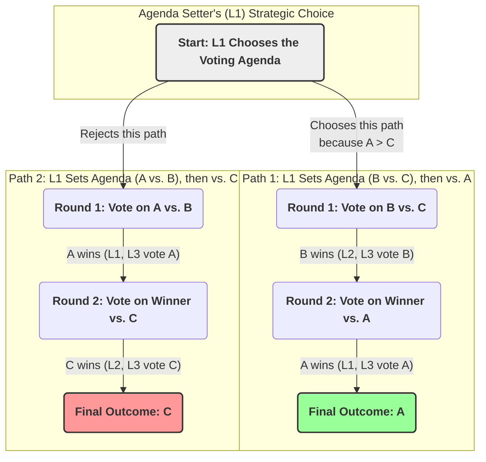

```mermaid
graph TD
    subgraph "Agenda Setter's (L1) Strategic Choice"
        N0("<b>Start: L1 Chooses the Voting Agenda</b>")
    end

    subgraph "Path 1: L1 Sets Agenda (B vs. C), then vs. A"
        N1("<b>Round 1: Vote on B vs. C</b>")
        N2("<b>Round 2: Vote on Winner vs. A</b>")
        O1("<b>Final Outcome: A</b>")
    end

    subgraph "Path 2: L1 Sets Agenda (A vs. B), then vs. C"
        N3("<b>Round 1: Vote on A vs. B</b>")
        N4("<b>Round 2: Vote on Winner vs. C</b>")
        O2("<b>Final Outcome: C</b>")
    end

    N0 -- "Chooses this path<br>because A > C" --> N1
    N0 -- "Rejects this path" --> N3

    N1 -- "B wins (L2, L3 vote B)" --> N2
    N2 -- "A wins (L1, L3 vote A)" --> O1

    N3 -- "A wins (L1, L3 vote A)" --> N4
    N4 -- "C wins (L2, L3 vote C)" --> O2
    
    style N0 fill:#eee,stroke:#333,stroke-width:2px
    style O1 fill:#9f9,stroke:#333,stroke-width:2px
    style O2 fill:#f99,stroke:#333,stroke-width:2px
```
