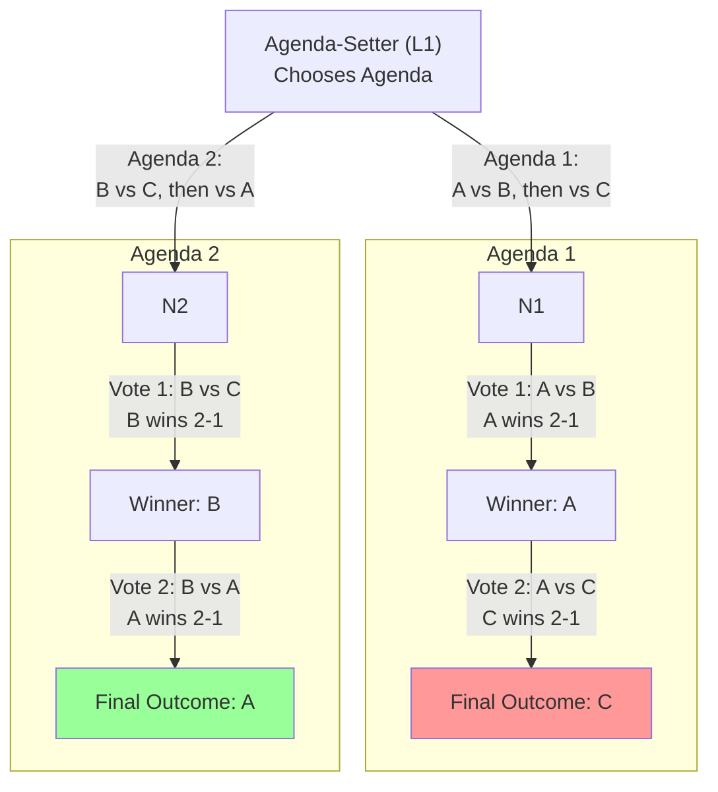

```mermaid
graph TD
    Start["Agenda-Setter (L1)\nChooses Agenda"] -->|Agenda 1:\nA vs B, then vs C| N1
    Start -->|Agenda 2:\nB vs C, then vs A| N2

    subgraph "Agenda 1"
        N1 -->|Vote 1: A vs B\nA wins 2-1| N1_Result["Winner: A"]
        N1_Result -->|Vote 2: A vs C\nC wins 2-1| Outcome1["Final Outcome: C"]
    end

    subgraph "Agenda 2"
        N2 -->|Vote 1: B vs C\nB wins 2-1| N2_Result["Winner: B"]
        N2_Result -->|Vote 2: B vs A\nA wins 2-1| Outcome2["Final Outcome: A"]
    end

    style Outcome1 fill:#f99
    style Outcome2 fill:#9f9
```
